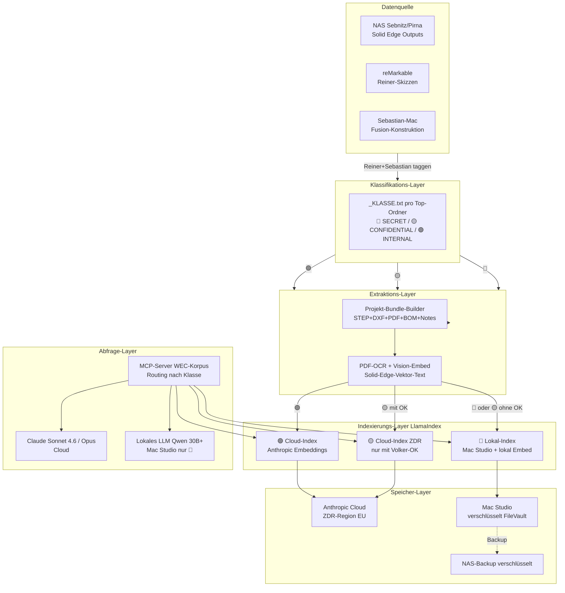

# Strategie — Korpus-Auslesen + KI-Pipeline

> **Status:** Konzept-Notiz, kein Handlungs-Auftrag.
> Eingang für Architektur-Entscheidungen vor Pirna-Umzug.
>
> Kontext: [[WEC Neustart mit Reiner#Update 2026-05-01 — Strategie scharf formuliert]]

## Ausgangslage

### Daten
- 6 Rechner aktuell in Sebnitz
- ~8 TB, könnte mehr sein
- 30 Jahre Konstruktions-Output: STEP, DXF, PDF, Stücklisten, Zeichnungen
- NAS-Netzwerk vorhanden, kommt mit nach Pirna
- Sicherungs-Pflicht: NICHT alles. Auslese-Pflicht: das Relevante.

### Personen
- **Reiner:** anti-Computer, bleibt aktiv, skizziert auf reMarkable
- **Sebastian:** Fusion-Konstrukteur, Zeichnungsableitungs-Lücke
- **Sabine** (alt): Zeichnerin, geht Ende August in Rente — Wissenstransfer offen (siehe [[Sabines Zeichnungswissen + Digitales Reißbrett]])

### Aufträge
- Volker (Bens): priorisiert, anspruchsvoll, qualitätsfokussiert
- Knauf: läuft
- Andere: vermutlich kaum noch

## Architektur-Frage

**Wie wird der 30-Jahre-Korpus für Sebastian/Claude/Pipeline nutzbar, ohne dass Sebastian Solid Edge lernen muss?**

## Datenquellen-Strategie (Sebastians Diktat 2026-05-01)

> „Ich komme an die Daten ran, die sind in Profilen gespeichert. CAD-Daten und fertige Zeichnungen. Ich denke das ist viel mehr wert als in Solid Edge reinzugehen — das ist später nur nice to have. Allein durch die Datensammlung von STEP, DXF, Stücklisten und Zeichnungen können wir viel besseren Kontext bilden — weil definiert ist wie es sein soll."

**Konsequenz:**
- Solid Edge als Software stilllegen (nach Korpus-Extraktion)
- Lizenzen behalten als Fallback / KI-Trainings-Erlaubnis
- Fokus: Output-Layer (PDF, STEP, DXF, Stückliste) extrahieren, klassifizieren, durchsuchbar machen

## KI-Pipeline-Optionen

### Option A: Cloud (Claude API + Projects)
- **Stärke:** Sofort verfügbar, beste Sprach-/Fach-Qualität, bekanntes Datenschutz-Modell (Anthropic-DPA)
- **Schwäche:** Volker/Bens-Daten gehen in Cloud — White-Label-Pflicht und „Selbst ist Sicherheit" Konflikt
- **Kosten:** API-Calls + ggf. Team/Enterprise-Abo
- **Status:** Heute praktikabel, langfristig Zielkonflikt

### Option B: Lokal (Mac Studio Ultra, künftig)
- **Stärke:** Keine Daten verlassen das Haus, langfristig unbegrenzte Nutzung, „Selbst ist Sicherheit" voll umgesetzt
- **Schwäche:** Hardware-Investition, lokale Modelle aktuell schwächer (siehe [[Lokale LLMs - Roadmap]] — verworfen 2026-04-24 wegen 64GB-Limit)
- **Kosten:** Mac Studio M5 Ultra 256GB (~10–12 k€?), einmalig
- **Status:** Re-Evaluierung wenn Hardware da (Juli+)

### Option C: Hybrid (Brückenzeit-Lösung)
- **Stärke:** Cloud für Sebastian-Workflow + lokale Pipeline für Bens-Sensitiv-Daten
- **Schwäche:** Mehr Komplexität, zwei Systeme parallel pflegen
- **Kosten:** Cloud-API + lokale Hardware (kleiner als Ultra)
- **Status:** Realistischer Weg für 2026, dann Migration auf B

## Sebastians Bauch (2026-05-01)

> „Ich denke theoretisch über lokale Modelle nach. Mehrwert: Sicherheit + Leistung. Kostet aber Geld — Brückenzeit überwinden, ist eine finanzielle Sache."

**Damit ist Pfad C der wahrscheinliche Weg:**
- Cloud (Anthropic) heute für Workflow-Beschleunigung
- Mac Studio Ultra als Hardware-Ziel (Juli+ realistisch)
- Migration sensitiver Daten auf lokal sobald Hardware steht

## Architektur-Detail Pfad C (CC, 2026-05-01)

Konkrete Komponenten-Skizze für Pfad C (Hybrid Cloud + lokal). Setzt Datenklassen 🔴/🟡/🟢 (Findings B2/C2) und Hardware-Realität (Mac Studio Q4 2026 / Q1 2027, Findings D2) um. Querverweise: B3 (lokale-LLM-Qualität), C2 (Klassifizierung), C3 (Pflege-Frequenz), E3 (Bus-Faktor 1).

### 1. Komponenten-Diagramm



**Lese-Hilfe:** Daten fließen oben→unten. Klassifikations-Layer ist die einzige Stelle, an der eine Datei umkategorisiert werden kann — danach ist der Pfad fix. MCP-Server unten ist Sebastians einziger Eingangspunkt, routet Anfragen automatisch zur richtigen Klasse und LLM.

### 2. Datenfluss pro Klasse

#### 🔴 SECRET (Reiner-Patent, NDA-pflichtig)

| Schritt | Wo | Wann verfügbar |
|---|---|---|
| Quelle | NAS Sebnitz, separater Ordner `_SECRET/` | heute |
| Klassifikation | manuell durch Reiner, Default-Override auf 🔴 | heute |
| Extraktion | lokal auf Sebastian-Mac, USB-Stick-Brücke | heute (Brückenzeit-Provisorium) |
| Indexierung | **Brückenzeit:** kein Index, manuelle Suche. **Mac-Studio-Phase:** lokales LlamaIndex + Qwen-Embeddings | Q1 2027 |
| Speicher | **Brückenzeit:** verschlüsseltes Sebastian-Mac-Disk-Image. **Mac-Studio-Phase:** Mac Studio FileVault | heute / Q1 2027 |
| Abfrage | **Brückenzeit:** Sebastian liest direkt, kein KI-Touch. **Ziel:** lokales LLM | Q1 2027 |
| Antwort | **Brückenzeit:** menschlich. **Ziel:** lokal Qwen 30B+ ohne Cloud-Round-Trip | Q1 2027 |

**Hybrid-Stub Tag 1:** 🔴-Daten gehen NIE in Cloud. Während Brückenzeit ohne Indexierung, weil Lokal-Hardware fehlt. Sebastian akzeptiert Geschwindigkeitsverlust für Patent-Sicherheit. Hypothese (nicht verifiziert): Reiner-Patent-Datenmenge ist klein genug (vermutlich <50 GB), dass manuelle Navigation reicht.

#### 🟡 CONFIDENTIAL (Bens, Knauf, Aufträge)

**Pfad A — mit Volker-Zustimmung schriftlich:**

| Schritt | Wo |
|---|---|
| Quelle | NAS Pirna, `Kunden/Bens/`, `Kunden/Knauf/` |
| Klassifikation | Sebastian Default 🟡, Reiner-Override möglich |
| Extraktion | lokal auf Sebastian-Mac → Bundle-Format Phase 2.3 |
| Indexierung | **LlamaIndex lokal → Embeddings via Anthropic API** (Bundle wird gechunkt, nur Chunks gehen kurzzeitig in Cloud, Index liegt lokal) |
| Speicher | **Index lokal Sebastian-Mac**, Vector-DB ChromaDB; Originale auf NAS; **Anthropic-Side: ZDR (kein 30-Tage-Retention)** |
| Abfrage | MCP-Server, Sebastian fragt via Claude Code oder claude.ai |
| Antwort | Cloud-Claude Sonnet 4.6/Opus mit Kontext aus lokalem Index |

**Pfad B — ohne Volker-Zustimmung:**

| Schritt | Wo |
|---|---|
| Indexierung | **lokal-only**, Embeddings via Mac-lokales Modell (z.B. nomic-embed-text via Ollama) |
| Speicher | komplett lokal Sebastian-Mac |
| Antwort | **Brückenzeit:** keine KI-Beschleunigung für Bens/Knauf-Daten — Sebastian arbeitet manuell oder mit anonymisierten Auszügen. **Mac-Studio-Phase:** lokales LLM beantwortet Bens/Knauf-Fragen |

**Entscheidungspunkt:** Volker-Gespräch (Phase-2-Punkt 5) entscheidet welcher Pfad. Bis dahin Default Pfad B (sicher).

#### 🟢 INTERNAL (DIN, Templates, anonyme Referenzen)

| Schritt | Wo | Wann |
|---|---|---|
| Quelle | NAS-Ordner `Normen/`, `Templates/`, `Anonyme Referenzen/` | heute |
| Klassifikation | Sebastian, Default 🟢 nur wo eindeutig | heute |
| Extraktion | lokal, Bundle-Format optional (PDFs reichen oft) | heute |
| Indexierung | **LlamaIndex + Anthropic Embeddings**, Cloud-Index | heute |
| Speicher | Anthropic Cloud (Standard-Retention OK, kein ZDR nötig) | heute |
| Abfrage | claude.ai-Projekt oder Claude Code MCP | heute |
| Antwort | Cloud-Claude | heute |

🟢 ist der „Sofort-Start" — kann jetzt schon gebaut werden, ohne Volker-OK, ohne Hardware. Pilot-Kandidat.

### 3. Sicherheits-Grenzen

| Komponente | Lokal | Cloud | Verschlüsselung at-rest | Verschlüsselung in-transit | Audit-Log |
|---|---|---|---|---|---|
| NAS Pirna | ✅ | — | LUKS/SED-Disks (TODO Sebastian) | TLS via Tailscale | NAS-Syslog |
| Sebastian-Mac | ✅ | — | FileVault | — | macOS Unified Log |
| Mac Studio (ab Q1 2027) | ✅ | — | FileVault | — | macOS Unified Log |
| LlamaIndex lokal-Index | ✅ | — | FileVault | — | App-Log (anlegen) |
| Anthropic Cloud 🟢 | — | ✅ | Anthropic-managed | TLS 1.3 | Anthropic-Konsolen-Log |
| Anthropic Cloud 🟡 ZDR | — | ✅ | Anthropic-managed, ZDR-Pflicht | TLS 1.3 | Anthropic-Konsolen-Log + ZDR-Audit |
| Anthropic Cloud 🔴 | NIE | NIE | n/a | n/a | n/a |
| MCP-Server | ✅ | — | FileVault | TLS lokal | App-Log Pflicht |

**Physische Trennung:** 🔴 verlässt das Haus nie. 🟡 verlässt das Haus nur als gechunkte Embedding-Anfragen, Chunk-Inhalte gehen NICHT als Klartext-Dateien hoch (LlamaIndex sendet Token-Blöcke an Embedding-API, nicht ganze Dateien). 🟢 darf vollständig hochgeladen werden.

**Hypothese (nicht verifiziert):** Anthropic-Embedding-API mit ZDR-Addendum hält Chunks nicht in Logs. Vor Pilot-Bau verifizieren.

### 4. Schnittstellen — Empfehlung MCP-Server

| Option | Aufwand | Kontrolle | Sebastian-Fit |
|---|---|---|---|
| claude.ai-Projekt mit Upload | sehr niedrig | niedrig (50-Datei-Limit, kein RAG-Tuning) | gut für 🟢-Pilot, schlecht für Skalierung |
| CLI/Terminal-Tool lokales RAG | mittel | hoch | passt zu Claude-Code-Workflow |
| Custom-UI Obsidian-Plugin / Web-App | hoch | sehr hoch | zu viel Eigenentwicklung, Bus-Faktor-Risiko E3 |
| **MCP-Server** | mittel | hoch | **passt in bestehenden Stack** (Filesystem-MCP, Cloudflare-MCP laufen bereits) |

**Empfehlung: MCP-Server `wec-korpus-mcp`** als zentraler Eingangspunkt.

Begründung:
- Sebastians Stack hat bereits Filesystem-MCP und Cloudflare-MCP — neuer MCP-Server fügt sich nahtlos ein, sowohl in Claude Code als auch in claude.ai.
- MCP-Tools können pro Klasse routen: `query_internal()`, `query_confidential()`, `query_secret()` — 🔴 ist ein lokales Tool, das gar nicht zur Cloud spricht.
- Wartung: ein einziger Server, keine UI-Pflege, keine Plugin-Updates.
- Reiner-Failover (siehe E3 / Phase 4): MCP-Server kann auf Reiners Mac kopiert werden, falls Sebastian ausfällt — Reiner kann zumindest Cloud-🟢 abfragen.

**Pilot-Kandidat:** zuerst nur `query_internal()` für 🟢-Daten bauen, parallel mit Sample-Korpus aus Phase-2-Punkt 3 testen. Wenn das läuft → 🟡-Tools dazu, dann 🔴 (sobald Mac Studio).

### 5. Fallback-Pfade

| Ausfall | Auswirkung | Recovery | RTO |
|---|---|---|---|
| Cloud-Claude unerreichbar | Keine 🟢/🟡-Antworten | Handy-Hotspot, sonst Wartezeit | <1 h typisch |
| Anthropic-Outage (>24 h) | Keine Cloud-Antworten | Sebastian arbeitet ohne KI-Beschleunigung; 🔴-Lokal-Pfad funktioniert weiter (sobald gebaut) | abhängig von Anthropic |
| LlamaIndex-Index korrupt | Keine RAG-Antworten, manuelle Suche | Re-Indexing aus Bundles (Bundles sind Source of Truth, Index ist Derivat) | 4–8 h pro Klasse |
| Sebastian-MacBook ausfällt (Diebstahl, Defekt) | Sebastian-Workflow blockiert; Index weg falls nur lokal | Time Machine + verschlüsseltes NAS-Backup; Bundles auf NAS unangetastet | 1–3 Tage Hardware-Tausch + Restore |
| NAS-Ausfall | Bundles weg, Originale auf Reiner-Win-PCs noch vorhanden | NAS-Restore aus Backup; Re-Extraktion möglich | abhängig von Backup-Strategie (TODO Sebastian) |
| Sebastian fällt aus (Bus-Faktor 1, E3) | WEC-KI-Workflow steht; Reiner kann Werkzeuge nicht bedienen | Notfall-Doku auf Papier; Reiner-Failover: MCP-Server-Klon auf Reiner-Mac (sobald Reiner einen hat); externer Fall-back-Berater (Anwalt/Steuerberater hat Zugang zu BWL-Doku) | Tage bis Wochen |

**Wichtigste Erkenntnis:** Bundles sind Source of Truth, Index ist Derivat. Wenn Index korrupt → re-indexieren. Wenn Bundles weg → echtes Problem. → Bundle-Backup-Strategie ist kritischer als Index-Backup.

### 6. Migrations-Pfad

| Phase | Zeitraum | Komponenten | Schmerzpunkte |
|---|---|---|---|
| **P0 — Heute** | Mai 2026 | claude.ai-Projekt für 🟢-Stichproben; manuelle Verarbeitung 🟡/🔴 | kein RAG, keine Skalierung |
| **P1 — Pilot 🟢** | Juni–Juli 2026 | MCP-Server `wec-korpus-mcp` mit `query_internal()`; LlamaIndex + ChromaDB lokal; Anthropic-Embeddings für 🟢; Daten-Inventar Sebnitz abgeschlossen (Phase-2-Vorzieher) | Klassifikation der Top-5-Ordner als Pilot |
| **P2 — Volker-Gespräch + 🟡** | August–September 2026 | Anthropic Enterprise + ZDR-Addendum (sofern verfügbar); Pfad-A oder Pfad-B-Entscheidung; `query_confidential()` Tool | Volker-Zustimmung schriftlich (E1); Sabine-Wissens-Transfer parallel (Rente Ende August!) |
| **P3 — Mac-Studio-Empfang** | Q4 2026 / Q1 2027 | Mac Studio M5 Ultra (oder Fallback M5 Max 128 GB); lokale Embedding-Pipeline; lokales LLM (Qwen 30B+) für 🔴 | Verfügbarkeits-Engstelle (Korrektur 1); Software-Tuning lokales LLM |
| **P4 — 🔴 Indexing** | Q1–Q2 2027 | `query_secret()` Tool; Reiner-Patent-Daten lokal indexiert; vollständiger Hybrid läuft | Reiner-Tempo respektieren (E2); kein Cloud-Touch verifizieren |
| **P5 — Optional 🟡 Migration zu Lokal** | 2027+ | Sobald lokales LLM Cloud-Qualität bei Maschinenbau-Fachfragen erreicht: 🟡 von Cloud-Pfad-A auf Lokal-Pfad migrieren | Index-Migration Cloud→Lokal; Bens-Rückfall-Klausel; B3 (lokale-LLM-Qualität) als Re-Eval-Trigger |

**Schmerzhafteste Migration:** P5 — von Cloud-🟡 auf Lokal-🟡. Voraussetzung: lokales LLM erreicht Qualität, die heute (2026-04-24-Test) klar verfehlt wurde. Hypothese (nicht verifiziert): Mac Studio M5 Ultra 256 GB + 2027er-Modelle (Qwen 3, Llama 5?) erreichen das. Wenn nicht: Pfad-A bleibt Dauerzustand → „Selbst ist Sicherheit"-Spannung (D3) bleibt unaufgelöst.

**Daten-Migration:** Bundles (Source of Truth) bleiben immer auf NAS, ziehen nicht um. Indizes werden bei Klassen-Wechseln neu gebaut (kein Migrations-Risiko, kostet nur Zeit + Embedding-Budget).

---

**STOP 3.** Sebastian validiert Architektur-Skizze, korrigiert/ergänzt — bevor Phase 4 (Risiko-Analyse) startet.

## Risiko-Analyse (CC, 2026-05-01)

Vier Risiko-Kategorien (technisch, finanziell, organisatorisch, strategisch). Anmerkungen Sebastian Phase-3-Validierung A/B/C eingearbeitet. Skala: W = Wahrscheinlichkeit (niedrig/mittel/hoch), I = Impact (niedrig/mittel/hoch — gemessen an Geld/Zeit/Existenz). Mitigation konkret, nicht „beobachten". Trigger = was eintreten muss, damit Mitigation aktiviert wird.

### 1. Technisch

| ID | Risiko | W | I | Mitigation | Verantw. | Trigger |
|---|---|---|---|---|---|---|
| **T1** | RAG-Test liefert nicht „Reiner-typische" Antworten (Finding A4) | mittel | hoch | RAG-Test als Pilot mit messbaren Top-3-Akzeptanzkriterien (Phase-2-Punkt 3); bei Fehlschlag Architektur überdenken statt skalieren | Sebastian | Pilot-RAG-Test mit Sample-Bundle Volker-Bens scheitert (<50 % Top-3-Treffer) |
| **T2** | Embedding-Pipeline-Kosten explodieren (Finding C5) | mittel | mittel | Pareto-Inventar zuerst (Phase-2-Vorzieher); Indexing nur auf gefilterten Korpus-Kandidaten, nicht 8 TB roh; Hard-Budget pro Indexing-Lauf (z.B. max 500 €) | Sebastian | Erste Embedding-Schätzung > 1.000 € pro Vollauflauf |
| **T3** | OCR-Qualität bei Solid-Edge-PDFs schlecht (Hypothese Phase-2-Punkt 3) | mittel | mittel | Pilot-OCR auf 5 Bens-PDFs vor Skalierung; Vektor-Text-Extraktion (pdfplumber) statt nur Bitmap-OCR; Fallback: manuelle Bemaßungs-Stichworte in `notes.md` pro Bundle | Sebastian | OCR-Pilot < 80 % Maß-/Toleranz-Erfassung |
| **T4** | Geometrie-Embedding 2026 unreif | hoch | niedrig | STEP-Metadaten als strukturierte Felder, nicht als Embedding (siehe Architektur §3); Geometrie-Suche manuell oder über BOM-Text | Sebastian | n/a (akzeptiert als Stand-der-Technik 2026) |
| **T5** | Lokales LLM erreicht nie Cloud-Qualität (B3, P5-Risiko) | mittel | hoch | Re-Eval bei jedem neuen lokalen Modell-Release; ehrliches Akzeptanzkriterium (z.B. „Maschinenbau-Fachfrage-Test 80 % Cloud-Niveau") statt Wunschdenken; Pfad-A als Dauerlösung akzeptieren wenn nötig (siehe S5) | Sebastian | Mac-Studio-Test 6 Monate nach Empfang verfehlt 80 %-Schwelle |
| **T6** | **Chunks-Klartext-Risiko 🟡 Pfad A (Sebastians Anmerkung A)** | hoch | mittel | Volker-Gespräch muss Klartext-Charakter explizit benennen, nicht „anonymisiert" suggerieren; Vorlage entsprechend formulieren; Pseudonymisierung von Bens-Kennungen vor Embedding prüfen (Bundle-Schritt) | Sebastian | Volker fragt explizit „werden Daten anonymisiert?" — präzise Antwort pflichtig |
| **T7** | Anthropic-Embedding-API hält Chunks doch in Logs (Architektur-Hypothese unverifiziert) | niedrig | hoch | Vor Pilot-Bau ZDR-Vertragstext lesen; explizite Frage an Anthropic Sales: „Werden Embedding-API-Inputs unter ZDR ebenfalls null-retentioniert?" | Sebastian | ZDR-Addendum-Text mehrdeutig oder verneint |

### 2. Finanziell

| ID | Risiko | W | I | Mitigation | Verantw. | Trigger |
|---|---|---|---|---|---|---|
| **F1** | Mac-Studio-Verzögerung verlängert Cloud-Brückenzeit, Brückenzeit-Kosten kumulieren | hoch | mittel | Anthropic-Volumen-Schätzung pro Monat dokumentieren; bei Verschiebung > Q1 2027 → Cloud-Plan re-evaluieren (Enterprise vs. API + ZDR) | Sebastian | Apple-Event Q4 2026 ohne Mac Studio Ankündigung |
| **F2** | Embedding 8 TB vier- bis fünfstellig (C5) | mittel | hoch | Pareto-Inventar zuerst (Phase-2-Vorzieher), tatsächliche Korpus-Größe vor Embedding bestätigen; Stichproben-Embedding (5 % Korpus) zur Hochrechnung vor Vollauflauf | Sebastian | Hochrechnung > 2.500 € — Stop, Sample-Reduktion |
| **F3** | Phase-2-Vorzieher zeigt < 1–2 TB Korpus-Kandidat → Hardware-Investition Mac Studio überdimensioniert | mittel | hoch | Inventar-Pilot triggert No-Go-Schwelle (siehe Phase-2-Vorzieher); bei Eintritt: Mac Studio M5 Max 128 GB statt Ultra 256 GB; oder Cloud-only-Strategie mit M4 Max | Sebastian | Pilot-Rechner-Hochrechnung < 2 TB |
| **F4** | Anthropic Enterprise-Mindestumsatz blockiert ZDR-Zugang | mittel | hoch | Sales-Anfrage explizit (Phase-2-Korrektur 2); Plan-B = API-Standard mit 30-Tage-Retention nur für 🟢; 🟡 lokal-only ohne KI-Beschleunigung in Brückenzeit | Sebastian | Anthropic-Sales-Antwort: kein ZDR für WEC-Volumen |
| **F5** | Sabine-Wissens-Transfer: Aufwand 4-Monats-Fenster bindet Personal | mittel | mittel | Indirekt-Strategie aus [[Sabines Zeichnungswissen + Digitales Reißbrett]] (Mitschreiben im Arbeitsalltag, nicht „Wissenstransfer-Projekt") + Reverse Engineering ihrer Zeichnungen; nicht parallel zu Korpus-Pipeline-Aufbau | Reiner+Sebastian | Sabine-Mai-Slot ungenutzt |
| **F6** | Pirna-Halle-Mietvertrag mit Volker-Abhängigkeit (TODO Vertrag-Vorprüfung) | mittel | hoch | Mietvertrag vor Unterschrift juristisch prüfen lassen; Klauseln zu Volker-Abhängigkeit identifizieren; Notausstiegs-Optionen verhandeln | Sebastian+Reiner+Anwalt | Mietvertrag-Entwurf erhalten |

### 3. Organisatorisch

| ID | Risiko | W | I | Mitigation | Verantw. | Trigger |
|---|---|---|---|---|---|---|
| **O1** | Sabine geht vor Wissens-Transfer (B2/C1, 4-Monats-Fenster zu eng) | hoch | hoch | Reverse-Engineering ihrer fertigen Zeichnungen als Backup-Pfad (auch ohne ihre Mitarbeit); 5 Sabine-Zeichnungen pro Woche von Reiner mitnehmen + Claude analysiert Muster | Reiner+Sebastian | Mai 2026 ohne Sabine-Material gestartet |
| **O2** | Reiner krank/unverfügbar während Inventar-Phase (E2/A3) | mittel | mittel | Pareto-Pilot-Rechner = Reiner-Hauptarbeitsplatz, Termin abstimmen; Reiner-Slot ~3 h flexibel planen; Inventar-Werkzeug funktioniert auch ohne Reiner-Anwesenheit (WinDirStat-Lauf, Anekdoten nachträglich) | Sebastian | Reiner > 2 Wochen ausfällt |
| **O3** | Pirna-Umzug verzögert sich, kollidiert mit Pipeline-Aufbau | hoch | mittel | Pipeline-Aufbau NICHT mit Pirna-Umzug verschränken; 🟢-Pilot kann unabhängig starten (P1); 🟡-Inventar wartet auf physische Konsolidierung in Pirna | Sebastian+Reiner | Umzugstermin-Verschiebung > 4 Wochen |
| **O4** | Volker zieht sich zurück bevor Zustimmung erteilt | niedrig | hoch | Volker-Gespräch früh (P2 Aug–Sept 2026), nicht hinausschieben; Pfad-B als Default-Plan parat haben (Bens-Daten lokal-only) | Sebastian | Volker antwortet nicht oder verzögert > 4 Wochen |
| **O5** | Bens als Hauptkunde fällt aus → Pipeline-ROI fraglich | niedrig | hoch | Knauf als zweites Standbein nutzen ([[00 Kontext/WEC Kontakte/Knauf]]); Pipeline auf Knauf-Daten parallel pilotieren (kein White-Label-Konflikt); 🟢-Norm-Layer ist kunden-unabhängig wertvoll | Reiner+Sebastian | Bens-Auftragsvolumen < 30 % Vorjahr |

### 4. Strategisch / Existenziell

| ID | Risiko | W | I | Mitigation | Verantw. | Trigger |
|---|---|---|---|---|---|---|
| **S1** | Single-Operator-Sebastian (E3, verschärft Anmerkung B) | hoch | hoch | **Realistische Bus-Faktor-Mitigation, nicht Reiner-Failover-Wunschdenken:** (a) Notfall-Doku auf Papier, geschützt im Tresor (BWL-Doku, Zugangsdaten-Liste, Anwalt-Kontakt); (b) Anwalt + Steuerberater haben Zugang zu BWL-Doku; (c) Ildi als zweite Person für Basis-Operationen anlernen (E-Mail, NAS-Zugriff) — sofern verfügbar/willens; (d) **Akzeptanz: temporärer Pipeline-Stillstand ist tragbar, weil Bundles auf NAS sind und Reiner-only-Notbetrieb auf Papier möglich** (Geschwindigkeitsverlust statt Ausfall) | Sebastian | sofort: Notfall-Doku in 30 Tagen aufgesetzt |
| **S2** | „Selbst ist Sicherheit" vs. Cloud-Brückenzeit (D3, verschärft Anmerkung C) | hoch | mittel | Explizite Brückenzeit-Frist setzen (z.B. 18 Monate); bei Überschreitung Strategie-Review pflichtig; akzeptierte Auslegung: 🟢 Cloud ist OK auch dauerhaft, 🔴 nie Cloud, 🟡 ist die strittige Zone | Sebastian | Brückenzeit überschreitet Q2 2027 |
| **S3** | Cloud-Vendor-Lock-in (Anthropic-spezifische Architektur) | mittel | mittel | LlamaIndex ist Anbieter-agnostisch (Embedding-Provider austauschbar); Bundles als Source of Truth bleiben portabel; MCP-Server hat Anthropic-spezifische Tools, aber Datenformat ist Standard | Sebastian | Anthropic-Preis-Erhöhung > 50 % oder Service-Einstellung |
| **S4** | Bens-Vertrag bei Cloud-Nutzung (Werkvertrag-Klausel-Konflikt) | mittel | hoch | Volker-Zustimmung schriftlich (Phase-2-Punkt 5) PLUS Werkvertrags-Klauseln juristisch prüfen vor Cloud-Indexing; Anwalt-Termin Patent-Federung als Anlass für Sammel-Beratung nutzen | Sebastian+Anwalt | Volker-Zustimmung erteilt, aber Werkvertrag schweigt zu Datenverarbeitung |
| **S5** | **P5-Nie-Eintritt: Pfad-A wird Dauer, gegen Kernprinzip (Sebastians Anmerkung C)** | hoch | hoch | **Drei akzeptable Auslegungen vor-formulieren, Sebastian wählt explizit:** (a) Cloud-🟡 dauerhaft akzeptieren, „Selbst ist Sicherheit" gilt nur für 🔴; (b) radikaler Pivot: nur 🟢 verarbeiten, 🟡 manuell + Cloud-only für eigene Produktivität (kein Bens-RAG); (c) Investition in eigenes Modell-Fine-Tuning auf Mac Studio (Aufwand hoch, Ergebnis ungewiss). Entscheidung pflichtig wenn lokales LLM zwei Re-Evals scheitert | Sebastian | Mac-Studio-Test + 1 Folge-Re-Eval scheitert (~Q3 2027) |
| **S6** | Pirna-Halle-Mietvertrag: WEC abhängig von Volker-Stimmung (Findings-Erweiterung) | mittel | hoch | Mietvertrag-Vorprüfung als TODO im [[00 Kontext/WEC Kontakte/Volker Bens]]-Profil; Notausstiegs-Klauseln verhandeln; alternative Halle als Fallback recherchieren | Sebastian+Reiner | Mietvertrags-Entwurf vorhanden |

---

### Top-3 Existenzielle Risiken (Zusammenfassung)

Aus den 24 Risiken oben drei, die WEC tatsächlich gefährden — nicht „Pipeline-Probleme", sondern „WEC steht/fällt":

1. **S1 — Single-Operator-Sebastian.** Wahrscheinlich nicht heute, aber irgendwann: Krankheit, Diebstahl, Krise. Reiner-Failover war Wunschdenken (Sebastians Anmerkung B). Realistische Mitigation = Notfall-Doku auf Papier + akzeptierter temporärer Stillstand der KI-Pipeline. Keine Heldengeschichte, sondern Akzeptanz: WEC läuft auch ohne Pipeline weiter, nur langsamer. **Sofort umsetzbar in 30 Tagen.**

2. **O1 — Sabine geht ohne Wissens-Transfer.** 4-Monats-Fenster, Reverse-Engineering ihrer fertigen Zeichnungen ist der einzige verlässliche Backup-Pfad. Wenn das Fenster ungenutzt bleibt, ist Norm-/Zeichnungs-Wissen dauerhaft weg, und der Korpus-Pipeline fehlt der Norm-Layer (B2/C1). **Trigger heute, nicht in Q3.**

3. **F6 + S6 — Pirna-Halle-Mietvertrag mit Volker-Abhängigkeit.** Wenn Mietvertrag schlecht verhandelt: WEC ist physisch von Volkers Stimmung abhängig. Kombiniert mit S4 (Bens-Werkvertrag) und O5 (Bens-Hauptkunde) ergibt sich ein **Cluster-Risiko Bens-Abhängigkeit**, das die Pipeline-Diskussion überschattet. **Anwalt-Termin frühzeitig terminieren, vor Mietvertrags-Unterschrift.**

Pipeline-interne Risiken (T1, F2, F3) sind mittlere Schmerzen, kein Existenz-Risiko — Bundles bleiben Source of Truth, Re-Index ist immer möglich.

---

**STOP 4.** Sebastian validiert Risiko-Analyse, korrigiert/ergänzt — bevor Phase 5 (Roadmap Q2–Q4 2026) startet.

## Roadmap Q2–Q4 2026 (CC, 2026-05-01)

Quartals-Granularität, keine Wochen-Aggressivität (Findings E2 Reiner-Tempo). Anmerkungen Sebastian Phase-4-Validierung D/E bindend: **Sabine-Pfad VOR Korpus-Pipeline-Vollausbau** (D), **P2 Volker-Gespräch nicht im Umzugs-Fenster Aug/Sept** (E) → P2 vorgezogen auf Juli 2026.

Pro Eintrag: Aufgabe — Verantw. — Abhängigkeit — Querverweis — Deadline/Trigger.

### Q2 2026 (Mai – Juni)

**MUSS**

| # | Aufgabe | Verantw. | Abhängigkeit | Querverweis | Trigger/Deadline |
|---|---|---|---|---|---|
| Q2-M1 | Bus-Faktor-Notfall-Doku auf Papier (BWL-Zugangsdaten, Anwalt-/Steuerberater-Kontakte, NAS-Master-Schlüssel im Tresor) | Sebastian | — | S1 | 30 Tage ab heute = bis 2026-05-31 |
| Q2-M2 | Mietvertrag-Anwalt-Prüfung sobald Entwurf vorliegt (Werkvertrags-Klauseln, Notausstieg, Bens-Abhängigkeit) | Sebastian + Anwalt | Mietvertrags-Entwurf | F6, S6 | Trigger: Vertrags-Entwurf erhalten |
| Q2-M3 | Pareto-Inventar Pilot-Rechner (WinDirStat + NAS, Reiner-Hauptarbeitsplatz, Go/No-Go-Schwelle 1–2 TB Korpus-Kandidat) | Sebastian | Sebnitz-Termin mit Reiner | F3, A1, P1 | bis Ende Juni 2026 |
| Q2-M4 | Sabine-Reverse-Engineering starten (5 Sabine-Zeichnungen pro Woche von Reiner mitnehmen, Claude analysiert Muster) | Reiner + Sebastian | Reiner-Slot ~1 h/Woche | O1, F5, Anmerkung D | sofort starten, läuft bis August |
| Q2-M5 | Vault-Sweep „SolidWorks → Solid Edge" (30 Dateien, Vault-Hygiene-Session) | Sebastian | — | B1 | bis Ende Juni 2026 |

**SOLLTE**

| # | Aufgabe | Verantw. | Abhängigkeit | Querverweis | Trigger/Deadline |
|---|---|---|---|---|---|
| Q2-S1 | Anthropic Sales-Anfrage senden (Enterprise + ZDR-Addendum, explizit „2-Personen-Büro zugänglich?") | Sebastian | — | F4, Klärungs-Recherche Pkt 5 | bis Ende Juni 2026, damit Antwort vor Juli-Volker-Gespräch da |
| Q2-S2 | Bundle-Format finalisieren + Sample-Bundle aus 1 Volker-Bens-Abschlussprojekt bauen (manuell, ohne Automatisierung) | Sebastian | Q2-M3 Pilot-Inventar Go-Signal | Klärungs-Recherche Pkt 3, P1 | bis Ende Juni |
| Q2-S3 | MCP-Server `wec-korpus-mcp` Skelett aufsetzen, Tool `query_internal()` mit Hardcoded-Sample für 🟢 | Sebastian | — | Architektur §4, P1 | bis Ende Juni |

**KANN**

| # | Aufgabe | Verantw. | Abhängigkeit | Querverweis | Trigger/Deadline |
|---|---|---|---|---|---|
| Q2-K1 | Ildi-Gespräch: bereit als zweite Person für Basis-Operationen (E-Mail, NAS) anlernen? | Sebastian | Ildi-Verfügbarkeit | S1 | offen |
| Q2-K2 | LlamaIndex + ChromaDB lokal installieren, Smoke-Test mit 5 Test-PDFs | Sebastian | — | T3, P1 | offen |

### Q3 2026 (Juli – September)

**Juli (vor Umzug) — MUSS**

| # | Aufgabe | Verantw. | Abhängigkeit | Querverweis | Trigger/Deadline |
|---|---|---|---|---|---|
| Q3-M1 | **Volker-Gespräch P2 vorgezogen** (Liefer-Beschleunigung framen, schriftliche Zustimmung Klartext-Charakter explizit, Pfad-A oder Pfad-B-Entscheidung) | Sebastian | Q2-S1 ZDR-Antwort, Anmerkung A T6 | T6, F4, O4, P2, Anmerkung E | bis Ende Juli |
| Q3-M2 | Anthropic Enterprise + ZDR-Vertrag abschließen ODER Plan-B-Beschluss (API-Standard nur 🟢, 🟡 lokal-only) | Sebastian | Q3-M1 Volker-OK | F4, P2 | bis Ende Juli |
| Q3-M3 | Sabine-Endspurt: 80 % der Reverse-Engineering-Stichproben abgeschlossen vor Rente | Reiner + Sebastian | Q2-M4 läuft | O1 | Mitte Juli |

**Juli SOLLTE**

| # | Aufgabe | Verantw. | Abhängigkeit | Querverweis | Trigger/Deadline |
|---|---|---|---|---|---|
| Q3-S1 | 🟢-Pilot-RAG-Test mit Sample-Bundle (Akzeptanzkriterium: Top-3 richtige Referenz-Zeichnung in 5 Test-Anfragen) | Sebastian | Q2-S2, Q2-S3 | T1, C4 | bis Ende Juli |
| Q3-S2 | Entscheidung **Korpus-Pflege-Frequenz: Batch initial, Streaming später** (C3) — fest dokumentieren, nicht offen lassen | Sebastian | — | C3 | Mitte Juli |

**August – September (Umzugsfenster) — MUSS**

| # | Aufgabe | Verantw. | Abhängigkeit | Querverweis | Trigger/Deadline |
|---|---|---|---|---|---|
| Q3-M4 | Pirna-Umzug operativ durchführen | Sebastian + Reiner | Halle bezugsfertig | O3, S6 | Aug–Sept |
| Q3-M5 | Sabine verabschieden, Reverse-Engineering-Material gesichert auf NAS | Reiner | Q3-M3 erfüllt | O1 | Ende August |

**Aug–Sept SOLLTE / KANN: nichts.** Bewusste Pause der Pipeline-Arbeit. **Reiner-Tempo (E2) gilt — keine parallelen großen Projekte.** Notfall-Reparaturen am Pipeline-Stand zulässig, kein Neubau.

### Q4 2026 (Oktober – Dezember)

**MUSS**

| # | Aufgabe | Verantw. | Abhängigkeit | Querverweis | Trigger/Deadline |
|---|---|---|---|---|---|
| Q4-M1 | Mac-Studio-Watch: Apple-Event Q4 verfolgen, Vorbestellung Tag 1 sobald M5 Ultra angekündigt (Verfügbarkeits-Engstelle) | Sebastian | Apple-Event-Termin | D2, F1, Korrektur 1 | Trigger: M5-Ultra-Ankündigung |
| Q4-M2 | Inventar-Sweep der restlichen 5 Rechner (sofern Q2-M3 Go-Signal) | Sebastian | Q2-M3 ≥ 2 TB; Pirna-Konsolidierung | F2, F3 | bis Ende November |
| Q4-M3 | 🟡-Indexing starten (Pfad A wenn Volker-OK aus Q3-M1, sonst Pfad B lokal-only) | Sebastian | Q3-M2 Vertrag, Q4-M2 Inventar | T6, P2 | bis Ende Q4 |

**SOLLTE**

| # | Aufgabe | Verantw. | Abhängigkeit | Querverweis | Trigger/Deadline |
|---|---|---|---|---|---|
| Q4-S1 | RAG-Pilot in Produktion für Sebastians Workflow (Briefings, Stücklisten-Suche, Norm-Lookups via MCP) | Sebastian | Q3-S1 erfolgreich | P1 | offen, läuft an wenn S1 grün |
| Q4-S2 | Knauf-Klassifikation: Reiner zu ungeschriebenen Vertraulichkeits-Klauseln befragen | Reiner + Sebastian | Reiner-Verfügbarkeit | Knauf-Befund Klärungs-Recherche | bis Ende Q4 |
| Q4-S3 | Plan-B-Trigger prüfen: M5 Ultra verfügbar oder Verschiebung > Q1 2027? | Sebastian | Q4-M1 Watch | D2, S2 | Ende Dezember 2026 |

**KANN**

| # | Aufgabe | Verantw. | Abhängigkeit | Querverweis | Trigger/Deadline |
|---|---|---|---|---|---|
| Q4-K1 | Lokales LLM Proof-of-Concept auf MacBook (Ollama, Qwen 30B Q4) — nur als Re-Eval-Vorbereitung, nicht produktiv | Sebastian | — | T5, B3 | offen |

---

### Kritischer Pfad

Fünf Aufgaben, an denen alles andere hängt. Wenn eine kippt, kippt der Rest. Watch-Liste für Wochen-Check-in:

1. **Q2-M3 Pareto-Inventar Pilot-Rechner** — Gate für die gesamte Pipeline. Bei < 2 TB Korpus-Kandidat → Konzept-Re-Eval, Hardware-Skala reduzieren, Roadmap kürzen.
2. **Q2-M1 Bus-Faktor-Notfall-Doku** — Existenzielles Risiko S1. Verzug erlaubt nicht.
3. **Q2-M4 + Q3-M3 Sabine-Reverse-Engineering** — 4-Monats-Fenster bis Rente. Verzug = dauerhafter Wissens-Verlust.
4. **Q3-M1 Volker-Gespräch + Q3-M2 Anthropic-Vertrag** — entscheidet Pfad-A vs. Pfad-B für 🟡. Verzug verschiebt Q4-M3.
5. **Q4-M1 Mac-Studio-Vorbestellung** — Hardware-Zugang trotz Engpass. Verpasst = Verschiebung um Quartale.

**Q2-M2 Mietvertrag-Anwalt** ist nicht zeitlich fix, sondern Trigger-getrieben — gehört trotzdem auf den Pfad, weil Bens-Cluster-Risiko (F6/S6) existenziell.

---

**STOP 5.** Sebastian validiert Roadmap, korrigiert/ergänzt — bevor Phase 6 (Pilot-Definition) startet.

## Pilot-Definition (CC, 2026-05-01)

**Pilot-Frage:** Findet die Pipeline aus dem Sample-Bundle das richtige Alt-Projekt, wenn Reiner nach einem ähnlichen Fall fragt?

**Input:**
- 1 abgeschlossenes Projekt als 🟢-Sample-Bundle (Bundle-Format aus Klärungs-Recherche Pkt 3)
- LlamaIndex + ChromaDB lokal, Anthropic-Embeddings
- MCP-Server `wec-korpus-mcp` mit `query_internal()`

**Zeitbox:**
- Setup: 2 Tage verteilt (Q2-S2 Bundle bauen + Q2-S3 MCP-Skelett, beide bereits in Roadmap)
- Durchführung: 1 Tag Ende Juli (Q3-S1)
- Auswertung: 0,5 Tage

**Erfolgsschwelle:** > 50 % funktionierende Treffer = grün, Roadmap Q4-M3 freigegeben (🟡-Indexing). Kein Top-3-Quoten-Theater, kein Re-Test-Verfahren. Wenn rot: Architektur-Re-Eval, nicht Skalierung.

**Out-of-Scope:**
- 🔴-Indexing
- 🟡-Indexing
- Geometrie-Embedding
- Solid-Edge-Re-Import
- Lokales LLM
- Streaming-Watcher
- Parameter-Tausch-Workflow

**Verantwortlich:** Sebastian. **Trigger Auswertung:** Ende Juli 2026.

---

**STOP 6.** Sebastian validiert Pilot-Definition. Konzept-Durchdenk damit abgeschlossen — Status der Notiz auf `konzept-vertieft` setzbar.

## Was muss erst geklärt werden (Klärungs-Liste)

- [ ] **Datenmenge konkret:** 8 TB nur Schätzung — Inventar nötig vor Korpus-Strategie
- [ ] **Daten-Klassifizierung:** Was ist Bens-White-Label-pflichtig? Was ist Reiner-Patent-sensitiv? Was unkritisch?
- [ ] **Korpus-Format:** Wie wird „abgeleitete Zeichnung + Stückliste + STEP" zu einem KI-lesbaren Datensatz?
- [ ] **Mac-Studio-Beschaffung:** Wann realistisch finanziell? WWDC Juni 2026 abwarten?
- [ ] **Brückenzeit-Cloud-Setup:** Welcher Anthropic-Plan? Team? Enterprise? Was sagt Anthropic-DPA für WEC-Use-Case?
- [ ] **Korpus-Extraktion-Werkzeug:** Selbst-skripten oder vorhandene Tools (z.B. RAG-Pipelines, llamaindex)?
- [ ] **Lizenz-Frage Solid Edge:** Lizenzen behalten als KI-Trainings-Erlaubnis — vertraglich machbar?

## Nächste Schritte (wenn Sebastian bereit)

1. Daten-Inventar in Sebnitz: Was ist wo, wie viel, welche Formate?
2. Sample-Korpus aus einem abgeschlossenen Projekt extrahieren
3. RAG-Test mit Cloud-Claude: kann KI aus dem Korpus „Reiner-typische" Norm-/Qualitäts-Antworten geben?
4. Wenn Test positiv: Skalierung planen, Hardware-Frage klären
5. Wenn Test negativ: Architektur überdenken

## Stress-Test Findings (CC, 2026-05-01 — Phase-1-Validierung Sebastian)

Systematische Prüfung der Konzept-Notiz gegen 6 Querverweise plus Sebastians Phase-1-Ergänzungen (E1-E3). Sortierung nach Schweregrad.

### 🔴 KRITISCH — Pipeline-Blocker bis geklärt

- **A1/D1 — Datenmenge real.** „30 Jahre Korpus" widerspricht [[Profil Reiner]] („~~4+ Jahre Projekte~~ → Klärung läuft"). Die 30 Jahre sind Reiners Berufserfahrung, nicht zwingend digitaler Bestand. 8 TB können erheblich kleiner werden, sobald „digital greifbar" gefiltert wird. Output-First-Strategie hängt zudem an STEP/DXF-Vollständigkeit: wenn historisch nur PDFs archiviert → wertarm für RAG. **Sample-Inventar (siehe Phase-2-Vorzieher unten) muss das vor allen anderen Recherchen klären.**
- **B1 — Profil-Reiner-Inkonsistenz.** [[Profil Reiner]] sagte „SolidWorks 2020", korrekt ist Solid Edge (Siemens, 4 Lizenzen 2021). Korrigiert 2026-05-01. **Mass-Sweep offen:** 31 Vault-Dateien enthalten „SolidWorks"-Bezug — eigene Sub-Aufgabe (TASKS.md), nicht Teil dieser Phase.
- **B2/C1 — Sabine-Transfer-Lücke.** [[Sabines Zeichnungswissen + Digitales Reißbrett]]: Norm-/Zeichnungs-Wissen sitzt bei Sabine, nicht in den Dateien. Konzept-Notiz behauptet aber „Korpus = Norm-/Qualitäts-Referenz". Sabine geht August 2026 in Rente — 4 Monate Fenster, in der Pipeline-Roadmap nicht erwähnt. Muss als paralleler Pfad rein, sonst fehlt der Norm-Layer dauerhaft.
- **A5/E1 — Volker-Zustimmung schriftlich (Sebastians E1).** Anthropic-DPA hilft DSGVO-rechtlich, sagt aber nichts über Volkers Einverständnis. Volker ist Verkäufer-Typ („verkauft Kühlschränke in der Antarktis"): mündliche Begeisterung kann schriftlich vergessen werden. **Phase-2-Punkt 5 muss auf „Volker-Zustimmung schriftlich" lauten, nicht nur DPA-Recherche.** Ohne unterzeichnete Zustimmung keine Bens-Daten in Cloud — auch nicht in Brückenzeit.
- **C6 — Reiner-Patent als TOP-SECRET-Klasse.** Fahrrad-Federung ([[Profil Reiner]]) gehört NIE in Cloud, auch nicht in Pfad-A-Brückenzeit. Konzept-Notiz erwähnt nur „Bens-sensitiv" — Patent-Klasse fehlt als eigene Kategorie. Heißt: mindestens Hybrid-Stub von Tag 1, nicht erst ab Mac-Studio-Ankunft.

### 🟡 WICHTIG — in Roadmap einplanen

- **D2 — Mac-Studio-Drop-Dead-Date.** „Q3/Q4 2026" ist Wunsch, nicht Plan. Finanzierung offen, WWDC Juni 2026 passiv abwarten. Wenn Hardware-Schritt sich nochmal um 6 Monate verschiebt → Pfad-A-Lock-in. Roadmap braucht Drop-Dead-Datum, ab dem Plan-B greift (kleinere lokale Hardware? Akzeptierte Cloud-Verlängerung mit nachgeschärftem Vertrag?).
- **E2 — Reiners Tempo (Sebastians E2).** Pirna-Umzug + neue Halle + Wegfall Sabine/Andreas/Steffen/Petra ist parallel viel für Reiner. „Reiners Tempo respektieren, Gründlichkeit ist keine Langsamkeit" ([[Profil Reiner]]). Roadmap (Phase 5) darf keine 4-Monats-Aggressivität ohne Reiner-Puffer setzen. Konkret: Korpus-Extraktions-Schritte, die physisch in Sebnitz/Pirna passieren müssen, brauchen Reiner-Verfügbarkeits-Slots.
- **E3 — Single-Operator-Risiko / Bus-Faktor 1 (Sebastians E3).** Sebastian wird Single-Point-of-Failure. Mac kompromittiert (wie 19.04. AtomicStealer), Krankheit, persönliche Krise → WEC steht. Reiner ist anti-Computer, kann nicht übernehmen. **Phase 4 (Risiko-Analyse) muss das als existenzielles Risiko führen, nicht erwähnen:** Wer kann was übernehmen? Wo liegen Schlüssel? Wie sieht Reiner-Failover aus? Notfall-Doku auf Papier?
- **B4 — Solid-Edge-Stilllegung als Endzustand, nicht Q2.** Konzept sagt „stilllegen nach Korpus-Extraktion". Realität: Reiner liefert weiter Bens-Aufträge in Solid Edge bis auf Weiteres. Stilllegung ist Endzustand der Pipeline-Reife, kein Q2-Meilenstein. Roadmap entsprechend phrasieren.
- **C3 — Korpus-Pflege-Frequenz.** Einmalig auslesen + Schluss? Oder lebendiger Korpus mit Watcher bei jedem neuen Auftrag? Architektur-Konsequenzen (Batch-Pipeline vs. Streaming) sind verschieden. Roadmap-Frage in Phase 5.

### 🟢 WICHTIG — in Phase 2-4 mitnehmen

- **A2** — STEP/DXF-Vollständigkeit prüfen (im Sample-Inventar)
- **A3** — Wer drückt physisch die Knöpfe in Sebnitz? Reiner anti-Computer → Sebastian bei Wochenend-Besuchen oder Pirna-Umzug als Anlass
- **A4** — „Korpus = Norm-Referenz" unbewiesen, im Pilot mit RAG-Test verifizieren
- **B3** — Lokale-LLM-Qualität: [[Lokale LLMs - Roadmap]] verworfen 2026-04-24, weil Cloud-Claude bei Fach-Deutsch deutlich überlegen. RAM löst das nicht automatisch — Phase-2-Punkt zu „aktuelle lokale Landschaft" muss Qualitäts-Frage explizit testen, nicht nur Hardware-Sizing
- **C2** — Daten-Klassifizierung wer/wie? Bens-sensitiv / Patent / unkritisch — Reiner allein, oder Schema mit Sebastian?
- **C4** — Erfolgsmetrik konkret: messbare Akzeptanzkriterien (z.B. „Korpus-RAG findet richtige Referenz-Zeichnung in Top-3"), nicht subjektives „Reiner-typisch"
- **C5** — Kostenschätzung Brückenzeit: Embedding 8 TB + laufende API-Calls können vier- bis fünfstellig sein, bevor erste Frage steht
- **C7** — [[Konzept Zwei Gehirne]] verlinken: Korpus-Pipeline ist Substrat für Phase 3 (Automatisierung), nicht isoliertes Projekt
- **D3** — „Selbst ist Sicherheit"-Spannung explizit auflösen: ab wann wird Brückenzeit-Cloud zur Dauer-Cloud?
- **D4** — Solid-Edge-EULA juristisch: Siemens gestattet Training auf Modell-Inhalten typischerweise nicht. Anwaltlicher Check.

---

## Phase 2 Vorzieher — Datenmenge-Inventar (CC, 2026-05-01)

**Vor** den 7 Klärungspunkten klärt CC, was tatsächlich digital greifbar ist. Begründung A1/D1: ohne reale Datenmenge sind alle anderen Recherchen Spekulation auf falscher Basis.

### Tool-Empfehlung Windows-Rechner

**Empfohlen: WinDirStat** (Open Source, klassisch, läuft offline)
- Download: windirstat.net
- Scannt Ordner-Baum, gruppiert nach Dateityp, Visualisierung als Treemap
- Export: Verzeichnisliste als CSV/TXT für Aggregation auf NAS-Ebene
- Vorteil: keine Cloud, keine Telemetrie, läuft auf Reiners Win-PCs ohne Installation (portable Version)

**Alternative: TreeSize Free** (JAM Software)
- GUI etwas moderner, sonst funktional ähnlich
- Free-Version reicht für Inventar

**PowerShell-Script** (für Sebastians Aggregation, nicht Reiner):
```powershell
Get-ChildItem -Path "Z:\" -Recurse -File -ErrorAction SilentlyContinue |
  Where-Object { $_.Extension -in @('.step','.stp','.iges','.igs','.dxf','.dwg','.dft','.par','.psm','.asm','.pdf','.xlsx','.xls','.csv') } |
  Group-Object Extension |
  Select-Object Name, Count, @{n='SizeGB';e={[math]::Round(($_.Group | Measure-Object Length -Sum).Sum/1GB, 2)}} |
  Sort-Object SizeGB -Descending |
  Export-Csv -Path "C:\Inventar.csv" -NoTypeInformation
```
Liefert pro Extension: Anzahl, Gesamt-GB. Ausgangspunkt für „digital greifbar"-Schätzung.

### Filter-Logik „digital greifbar"

**IN-Liste (Korpus-Kandidaten):**
- 3D-Konstruktion: STEP/STP, IGES/IGS, Solid-Edge-nativ (.par, .psm, .asm)
- 2D-Zeichnung: DXF, DWG, DFT (Solid Edge Draft), PDF
- Stücklisten/Daten: XLSX, XLS, CSV
- Spezifikationen: PDF (separat klassifizieren — kann Norm-Doku, Datenblatt oder Lieferschein sein)

**OUT-Liste (nicht Korpus):**
- E-Mails (Outlook .pst, .ost) — separates Thema, nicht Konstruktions-Korpus
- Office-Dokumente DOCX/PPTX — wenn nicht stücklisten-relevant: raus
- OS-Dateien, Programm-Installer, temporäre Dateien
- Bild-Renderings (JPG/PNG ohne Konstruktions-Bezug)

**Graubereich (separat klassifizieren):**
- DOCX mit Stücklisten-Tabellen → IN
- PDF-Scans alter Hand-Zeichnungen → IN aber niedrige Priorität
- ZIP-Archive → entpacken bevor inventarisieren

### Frage-Schema pro Rechner (Sebnitz-Besuch, ~1 h pro Rechner)

Für jeden der 6 Rechner einen Bogen ausfüllen:

1. **Rolle:** Reiner-Workstation? Konstruktions-Rechner? Datei-Server? Backup-Maschine?
2. **OS + Solid-Edge-Version:** Win 10/11, Solid Edge ST/2021/2024?
3. **Lokale Festplatten + Größe:** C:, D:, weitere; jeweils Belegung
4. **NAS-Mappings:** welche Laufwerksbuchstaben zeigen auf welche NAS-Shares?
5. **WinDirStat-Lauf** auf C: und allen lokalen Disks → CSV nach `\\NAS\Inventar\<Rechnername>_local.csv`
6. **WinDirStat-Lauf** auf NAS-Mappings → einmal zentral, nicht pro Rechner doppeln
7. **„Aktiv vs. Archiv":** welche Ordner sind laufende Projekte, welche schlafend?
8. **Reiner-Anekdoten:** „Dieser Ordner ist alt, nie mehr ranschauen" / „hier liegt das Bens-Zeug" — als Notiz festhalten, hilft später bei Klassifikation

### Output

Eine Aggregations-Datei `Datenmenge-Inventar 2026-05-XX.md` in `02 Projekte/WEC Neustart mit Reiner/` mit:
- Gesamt-GB Brutto
- Gesamt-GB nach IN-Filter (= Korpus-Kandidat)
- Top-5 Verzeichnisse nach Größe
- Anteil STEP+DXF vs. nur PDF (entscheidet Output-First-Strategie-Tragfähigkeit)
- Hot-Spots: wo sitzen die wertvollsten Daten?

### Voraussetzungen

- Sebastian-Besuch in Sebnitz oder Pirna mit Zugang zu allen 6 Rechnern + NAS
- Reiner-Slot ~3 h für Anekdoten + Klassifikations-Hinweise (Punkt 7+8)
- WinDirStat als portable Version auf USB-Stick mitbringen (Reiner-Win-PCs ohne Installer-Rechte)

### Pareto-Vorgehen — Pilot-Rechner zuerst (Sebastians Korrektur)

Bevor 6-Rechner-Sweep: ein einzelner Pilot-Rechner (Reiners Hauptarbeitsplatz) bekommt WinDirStat-Lauf + NAS-Inventar. Liefert ersten realistischen Datenpunkt: „X GB pro Rechner, Korpus-Kandidat-Anteil Y %". Daraus grobe Hochrechnung aufs Gesamt-Inventar.

**Go-/No-Go-Schwelle:**
- **< 1–2 TB Korpus-Kandidat hochgerechnet** → Pipeline-Konzept in Frage stellen. „8 TB"-Annahme dann komplett falsch, KI-Pipeline-Aufwand möglicherweise überdimensioniert. Eskalation an Sebastian, Konzept überdenken.
- **≥ 1–2 TB Korpus-Kandidat hochgerechnet** → die anderen 5 Rechner durchlaufen, vollständiges Inventar erstellen.

Aufwand Pilot-Rechner: ~2 h (statt ~6 h × 6 Rechner). 80/20: ein Rechner liefert das Konzept-Killer-Signal, falls vorhanden.

---

**STOP 1.** Sebastian validiert Phase-1-Findings + Phase-2-Vorzieher. Erst dann starten die anderen 6 Klärungspunkte (Phase 2 regulär).

---

## Klärungs-Recherche (CC, 2026-05-01)

Sechs Klärungspunkte (Datenmenge bereits durch Vorzieher abgedeckt). Pro Punkt: Status, Antwort mit Quellen, nächster Schritt für Sebastian. Wo Web-Recherche stattfand, ist die Quelle verlinkt; wo nicht verifiziert, explizit als Hypothese gekennzeichnet (Regel 17).

### 2. Daten-Klassifizierung — Schema-Vorschlag

**Status:** teil-gelöst (Schema-Vorschlag, Klassifizierungs-Akt steht aus).

**Antwort:** Drei-Klassen-Schema, pro Datei genau ein Tag:

| Klasse | Definition | Cloud-Verarbeitung | Beispiele |
|---|---|---|---|
| **🔴 SECRET** | Reiner-Patent, NDA-pflichtig | NIE Cloud, auch nicht Brückenzeit | Fahrrad-Federung, NDAs in Anmeldung |
| **🟡 CONFIDENTIAL** | Kunden-Konstruktion, Bens-White-Label, BWL-relevant | nur mit schriftlicher Kundenzustimmung + ZDR | Bens-Aufträge, Knauf-Konstruktion, Angebote, Verträge |
| **🟢 INTERNAL** | unkritisch, Norm-/Referenz-Material, eigene Templates | freigegeben für Cloud | DIN-Normen, Schraubentabellen, eigene Vorlagen, abgelaufene/anonyme Projekte |

**Klassifizierungs-Workflow:**
1. **Default = 🟡 CONFIDENTIAL** (sicherer Default — nur explizit hochgestuft auf 🔴 oder runtergestuft auf 🟢).
2. **Tag-Quelle pro Ordner**, nicht pro Datei (skaliert). Jeder Top-Level-Kunden-/Projekt-Ordner bekommt einen Tag in einer Sidecar-Datei `_KLASSE.txt`.
3. **Reiner entscheidet bei 🔴**, Sebastian validiert. Bei 🟢 entscheidet Sebastian, Reiner validiert stichprobenartig.
4. **Bei Konflikt:** höchste Klasse gewinnt (ein Ordner mit Bens-Anteilen ist immer mind. 🟡, auch wenn 90 % Norm-Doku).

**Nächster Schritt:** Pilot-Klassifikation auf Stichprobe von 5 Top-Level-Ordnern aus Sebnitz, im Rahmen des Inventar-Pilots. Liefert auch Schätzung: wie viel Prozent ist tatsächlich 🟢 (Cloud-tauglich)?

### 3. Korpus-Format — RAG-tauglicher Datensatz

**Status:** teil-gelöst (Format-Skizze, Pilot zur Validierung steht aus).

**Antwort:** Korpus pro Projekt als zusammenhängendes „Bundle" indexieren. Strukturvorschlag:

```
Projekt_<Kunde>_<Auftragsnr>/
├── meta.json          # Kunde, Datum, Klasse, Material, EHEDG?, Status
├── description.md     # Kurzbeschreibung (von Reiner oder aus Auftragstext extrahiert)
├── geometry/
│   ├── teil_01.step   # 3D-Geometrie
│   └── teil_01.dxf    # 2D-Ableitung
├── drawings/
│   ├── teil_01.pdf    # gerenderte Zeichnung
│   └── teil_01_text.txt  # OCR-Extrakt der Zeichnung (Maße, Toleranzen, Schweißzeichen)
├── bom.csv            # Stückliste, normalisiert
└── notes.md           # Reiner-Anekdoten, Lessons, Sonderlocken
```

**Indexierungs-Strategie:**
- **Text-Embeddings** für `description.md`, `notes.md`, OCR-Extrakte, BOM-CSV — Standard-RAG.
- **STEP/DXF-Metadaten** (Volumen, Material, Bounding-Box, Feature-Liste) als strukturierte Felder, nicht als Embedding. Geometrie-Embedding ist 2026 noch unausgereift.
- **PDF-Zeichnungen:** OCR plus Vision-Embedding (Claude Sonnet 4.6 hat Vision) für visuelle Ähnlichkeitssuche.

**Hypothese (nicht verifiziert):** OCR von Solid-Edge-PDFs liefert brauchbare Maß-/Toleranz-Texte, weil Solid Edge Vektor-Text exportiert. Im Pilot prüfen.

**Nächster Schritt:** Sample-Korpus aus einem Volker-Bens-Abschluss als Test-Bundle bauen, Format validieren, dann skalieren.

### 4. Mac-Studio-Beschaffung

**Status:** gelöst (Marktdaten Stand Mai 2026).

**Antwort:**
- **Release-Termin:** Bloomberg/Gurman 2026-04-19: Supply-Chain-Probleme, Mac Studio M5 möglicherweise erst **Oktober 2026** (statt WWDC Juni 2026 wie ursprünglich erwartet).
- **Spezifikation M5 Ultra:** ~36 CPU-Kerne, bis 80 GPU-Kerne, **Basis-RAM 96 GB, Vollausbau bis 256 GB (hard cap, RAM-Lieferketten-bedingt)**, Thunderbolt 5, Wi-Fi 7.
- **Spezifikation M5 Max:** bis 128 GB Unified Memory.
- **Preis-Range (Hypothese):** aktueller M2/M4-Ultra-Basis $3.999, M5-Ultra mit Tariff-Aufschlag wahrscheinlich **$4.200–$4.500 Basis**, Vollausbau 256 GB erfahrungsgemäß $7.500–$10.500.
- **Verfügbarkeits-Engstelle (Korrektur Sebastian 2026-05-01):** aktuelle M3-Ultra-Mac-Studios mit 128 GB / 256 GB sind **bereits jetzt nicht bestellbar** im Apple Online Store. RAM-Engpass dauert wahrscheinlich das ganze Jahr 2026 an. Verfügbarkeit selbst nach Release ist Engstelle, nicht Release-Termin allein.
- **Alternativen für 2026:**
  - **Mac Studio M4 Max (heute kaufbar, sofern auf Lager):** ~$1.999–$3.500, 64–128 GB Unified, deutlich günstiger, reicht für 30B-Modelle. Risiko: schon getestet 2026-04-24, Qualität schwächer als Cloud-Claude.
  - **NVIDIA DGX Spark (Workstation):** Linux/CUDA-Pfad, höhere Software-Kompatibilität für Embedding-Pipelines, aber Apple-Ökosystem-Bruch.
  - **Cloud-Verlängerung:** Anthropic API + ZDR-Addendum als Brücke bis 2027.

**Konsequenz für Roadmap:** Mac-Studio-Drop-Dead-Date (Findings 🟡 D2) auf **Q4 2026 / Q1 2027** schieben. WWDC Juni 2026 nicht mehr realistisch. Plan-B = Cloud-Verlängerung mit ZDR-Addendum + Hybrid-Stub für 🔴 SECRET-Daten.

**Plan-B Verfügbarkeit (Korrektur 1):** sobald M5-Ultra-Release angekündigt → **Vorbestellung Tag 1**, weil RAM-Engpass die Wartezeit nach Release auf Wochen bis Monate strecken kann. Falls 256 GB nicht verfügbar: M5 Max mit 128 GB als **Mindest-Fallback-Konfiguration** prüfen — limitiert lokale KI-Modellgröße (max ~70B Q4), reicht für RAG-Indexing-Server, reicht NICHT für Konkurrenz zu Cloud-Claude bei Fachfragen.

**Nächster Schritt:** Sebastian setzt Watch auf Apple-Event-Kalender Q3 2026 + Verfügbarkeits-Tracker im Apple Online Store. Bei Verschiebung über Q1 2027 → Konzept-Notiz Pfad-A (reine Cloud) re-evaluieren.

### 5. Volker-Zustimmung + Anthropic-DPA + Cloud-Plan-Vergleich

**Status:** teil-gelöst (DPA-Lage klar, Volker-Gespräch steht aus).

**Antwort — Anthropic-DPA-Lage 2026:**
- **Claude for Work / Claude Enterprise / API:** Daten werden **nicht für Modell-Training verwendet**, automatisch via Commercial Terms + DPA. Kein Opt-in/Opt-out nötig.
- **Zero Data Retention (ZDR):** als optionales Addendum für Enterprise-Kunden verfügbar — separater Vertrag, Daten werden NICHT 30 Tage gehalten, sondern direkt verworfen. Voraussetzung: Enterprise-Stufe + signiertes Security-Addendum.
- **API-Standard-Retention:** 30 Tage für Trust-&-Safety, danach gelöscht. Längere Retention nur per DPA-Update opt-in (Audit-Use-Case).
- **Consumer-Claude:** seit August 2025 Opt-out-Modell für Training — **NICHT relevant für WEC**, weil Sebastian Pro/API-Stufe nutzt.

**Plan-Vergleich Brückenzeit:**

| Plan | Preis 2026 | Modell-Training | ZDR | Empfehlung WEC |
|---|---|---|---|---|
| Claude Pro | ~$20/Monat | nein | nein | zu klein, kein DPA-Hebel |
| Claude Team | ~$30/User/Monat | nein | nein | für 2 User OK, kein ZDR |
| Claude Enterprise | individuell | nein | **ja, optional** | **empfohlen für 🟡 CONFIDENTIAL** |
| API Standard | nutzungsbasiert | nein | nein (30 Tage) | für Pipeline-Indexing |
| API + ZDR-Addendum | individuell | nein | **ja** | **empfohlen für RAG-Pipeline** |

**Volker-Gespräch — Strategie:**
- **Nicht „Datenschutz-Frage" framen** (defensiv) sondern **„Liefer-Beschleunigung durch KI" framen** (offensiv): Bens bekommt schnellere Antworten, weil WEC einen 30-Jahre-Wissens-Index nutzt.
- **Schriftliche Zustimmung pflichtig.** E-Mail mit konkreter Formulierung („Volker stimmt zu, dass Bens-Konstruktionsdaten anonymisiert/pseudonymisiert in einem KI-RAG-Index verarbeitet werden, Anbieter Anthropic mit ZDR-Addendum, kein Modell-Training, keine Weitergabe"). Volker antwortet schriftlich, nicht mündlich (E1-Risiko: Verkäufer-Gedächtnis).
- **Fallback wenn Volker ablehnt:** Bens-Daten ausschließlich in lokaler Pipeline verarbeiten (Mac Studio, später). Brückenzeit für Bens-Daten: nicht möglich → Volker-Aufträge ohne KI-Beschleunigung weiterführen.

**Nächster Schritt:**
1. Anthropic Enterprise + ZDR-Addendum-Anfrage senden (Sales-Kontakt). **Explizite Frage (Korrektur 2):** „Ist Enterprise + ZDR-Addendum für ein 2-Personen-Ingenieurbüro mit niedrigem Anfangs-API-Volumen zugänglich, oder gibt es Mindestumsatz-Anforderungen?" Preis-Range einholen.
   - **Falls NEIN (kein Enterprise-Zugang für WEC-Größe):** Plan-B = API Standard mit 30-Tage-Retention. Juristisch problematisch für Bens-Zustimmung, daher Mitigation: **nur 🟢 INTERNAL-Daten in Cloud, 🟡 CONFIDENTIAL Bens-/Knauf-Daten ausschließlich lokal verarbeiten** (Brückenzeit ohne Cloud-Beschleunigung für Kunden-Daten — KI hilft Sebastians Eigen-Workflow, nicht Bens-Antworten).
2. Volker-Gespräch terminieren, schriftliche Formulierung als Vorlage von Sebastian/CC vorbereiten.

### 6. Korpus-Extraktion-Werkzeug — Framework-Vergleich

**Status:** gelöst (Empfehlung steht).

**Antwort — Framework-Landschaft 2026:**

| Framework | Stärke | Schwäche | Eignung WEC |
|---|---|---|---|
| **LlamaIndex** | Retrieval-Qualität (35 % besser als LangChain in Benchmarks), CAD-/Doc-fokussiert | weniger Orchestrierung, weniger Agent-Tools | **Kern-Empfehlung für Korpus-Indexing** |
| **LangChain / LangGraph** | breiteste Integrationen, 70+ LLM-Provider, Agent-Orchestrierung | höhere Token-Kosten, Komplexität | für späteren Agent-Layer (Sebastian-Workflow) |
| **Haystack** | strukturierte Pipelines, regulierte Branchen (Healthcare/Legal/Finance), Token-effizient | kleinere Community | sinnvoll für Bens-EHEDG-Compliance-Audits |

**Empfehlung — Hybrid-Stack (Production-Pattern 2026):**
- **Ingestion + Retrieval:** LlamaIndex (CAD-Bundles, STEP/DXF/PDF/CSV → Vector-Index)
- **Orchestrierung + Sebastians Workflow:** LangChain/LangGraph (Tools, Agent-Logik, Briefings)
- **Compliance-Audit für Bens:** Haystack-Pipeline für nachweisbare Norm-Konformität (optional, später)

**Eignung zu Sebastians Setup:** Mac, Python, Cloud-Claude — alle drei laufen nativ. LlamaIndex hat den besten Python-/Mac-Pfad und beste Solid-Edge-/STEP-Adapter (via Drittpaket `llamahub`).

**Nächster Schritt:** Sample-Korpus mit LlamaIndex bauen (1 Volker-Bens-Abschluss-Projekt), gegen Cloud-Claude abfragen, gegen Reiner-Erwartung validieren.

### 7. Solid-Edge-EULA + KI-Trainings-Erlaubnis

**Status:** gelöst für WEC-eigene Output-Daten. Anwalt-Check nur für Grenzfälle.

**Klarstellung (Korrektur 3 Sebastian):** zwei verschiedene Regelwerke nicht vermischen:
- **A. Siemens-AI-Services-EULA** — gilt für Siemens-eigene KI-Tools (z.B. NX AI, Solid-Edge-AI-Features). Trainings-Verbote (siehe unten) treffen **dieses** Regelwerk.
- **B. Solid-Edge-Software-Lizenz** — gilt für die CAD-Software selbst. Eigene Konstruktionsoutputs (STEP/DXF/PDF aus eigener Konstruktion) gehören dem **Werkbesteller** (= WEC), nicht Siemens. Standard-Werkvertragsrecht, keine Lizenz-Frage.

**Konsequenz:**
- ✅ **Eigene Konstruktionsdaten in eigenes RAG indexieren = unstrittig zulässig.** WEC ist Eigentümer der Output-Dateien (STEP, DXF, PDF, BOM, Notizen). Keine EULA berührt das.
- ❌ **Nicht in RAG aufnehmen:** Siemens-Manuals, Solid-Edge-Hilfetexte, mitgelieferte Norm-Bibliotheken, Siemens-Schraubendaten, Siemens-DIN-Datenbanken — urheberrechtlich Siemens.
- 🤔 **Grenzfall (Anwalt-Check):** mitgelieferte Schriftfeld-Templates aus Siemens-Lieferung. Eigene WEC-/Bens-Templates: unkritisch.

**Siemens-AI-Terms zur Kenntnis (gelten für Siemens-AI-Services, nicht Solid-Edge-Software):**
- Verbot Training konkurrierender AI auf Siemens-AI-Output
- Verbot Web-Scraping aus Siemens-AI-Services
- Verbot Training jeglicher AI auf Siemens-Dokumentation

**Nächster Schritt:**
1. **Pragmatisch:** Korpus-Indexing-Whitelist auf WEC-eigene Output-Daten beschränken (eigene Konstruktionen, eigene Templates, Reiner-Notizen, eigene Stücklisten). Siemens-Manuals und mitgelieferte Bibliotheken explizit auf Blacklist.
2. **Juristisch (klein):** bei nächstem Anwalt-Termin (Patent-Beratung Reiner-Federung) Frage zu Schriftfeld-Templates aus Siemens-Lieferung mitnehmen — kein Show-Stopper.

---

**Quellen Phase-2-Recherche:**
- Mac Studio: [Macworld 2026](https://www.macworld.com/article/2973459/2026-mac-studio-m5-release-date-specs-price-rumors.html), [MacRumors](https://www.macrumors.com/2025/11/04/mac-studio-m5-ultra-2026/)
- Anthropic DPA: [Anthropic Privacy Center](https://privacy.claude.com/en/articles/7996862-how-do-i-view-and-sign-your-data-processing-addendum-dpa), [Char Blog 2026](https://char.com/blog/anthropic-data-retention-policy/)
- RAG Frameworks: [Iternal AI](https://iternal.ai/blockify-rag-frameworks), [AlphaCorp 2026](https://alphacorp.ai/blog/rag-frameworks-top-5-picks-in-2026), [Kanerika](https://kanerika.com/blogs/llamaindex-vs-langchain-vs-haystack/)
- Siemens AI-Terms: [Siemens AI Terms of Use](https://www.sw.siemens.com/en-US/sw-terms/ai/), [Siemens EULA](https://www.sw.siemens.com/en-US/sw-terms/base/eula/)

---

### Zusatz Phase-2-Validierung — Knauf-Klassifizierung

**Status:** geprüft (CC, 2026-05-01).

**Befund aus [[00 Kontext/WEC Kontakte/Knauf]]:**
- Knauf = Baubranche, Gips, Stahlkonstruktionen, Anlagenbau, Fördertechnik
- Standort Thüringen, übernommener Großbetrieb mit Instandhaltungs-Nachholbedarf
- **Keine White-Label-Pflicht im Profil dokumentiert** (im Gegensatz zu Bens). WEC liefert direkt an Knauf, kein verschachtelter Endkunde.

**Klassifikations-Empfehlung:** Knauf-Daten **🟡 CONFIDENTIAL** als sicherer Default (Werkvertrag, Kunden-Konstruktion ist immer vertraulich), aber **ohne zusätzliche White-Label-Klausel-Risiken** wie bei Bens. Cloud-Verarbeitung mit ZDR plausibel zustimmungsfähig.

**Nächster Schritt:** bei Phase-3-Architektur Knauf als zweite Pilot-Klasse mitdenken (nicht als zwingenden Cloud-Blocker). Reiner kurz fragen, ob es ungeschriebene Knauf-Vertraulichkeits-Klauseln gibt.

---

**STOP 2.** Sebastian validiert Klärungs-Recherche, korrigiert/ergänzt — bevor Phase 3 (Architektur-Skizze Pfad C konkret) startet.

## Verknüpfungen

- [[WEC Neustart mit Reiner]]
- [[Konzept Zwei Gehirne]]
- [[Sabines Zeichnungswissen + Digitales Reißbrett]]
- [[02 Projekte/Lokale LLMs - Roadmap]]
- [[02 Projekte/WEC/Recherche/Digitales Zeichenbrett für Reiner]]
- [[03 Bereiche/Selbst ist Sicherheit]]
- [[03 Bereiche/WEC/CLAUDE]]
