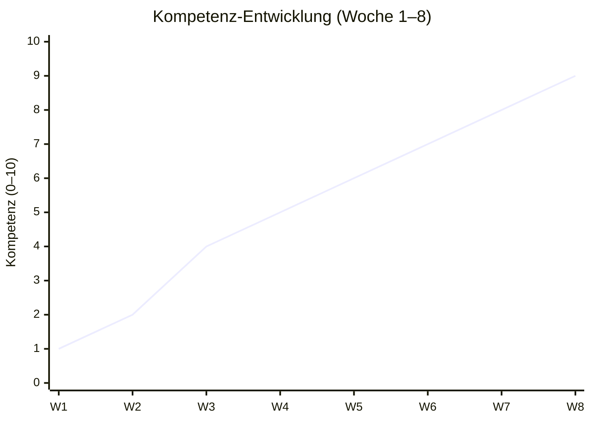
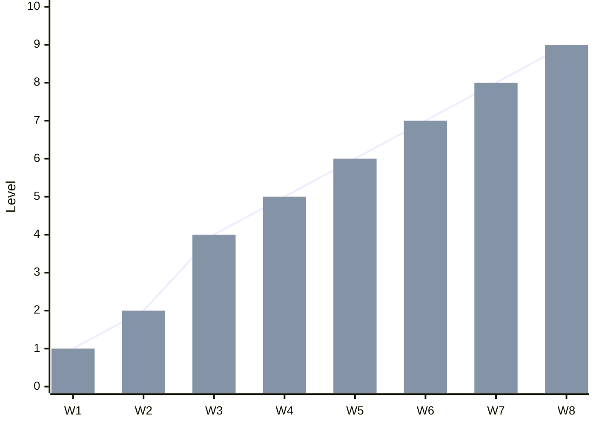
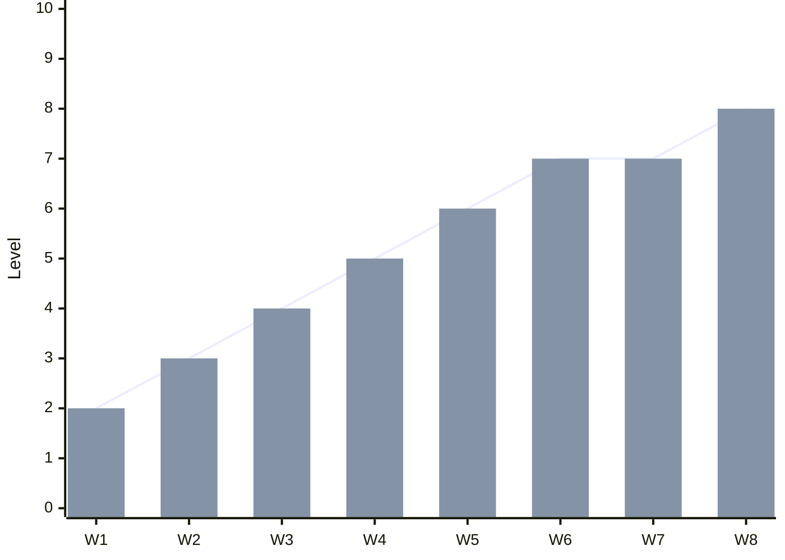
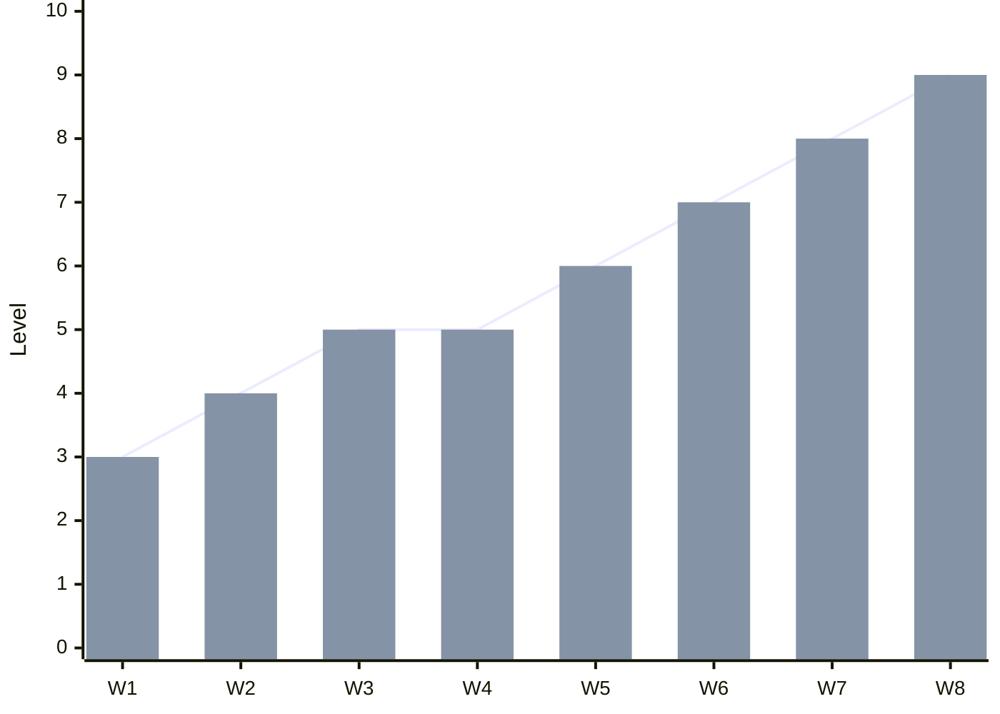
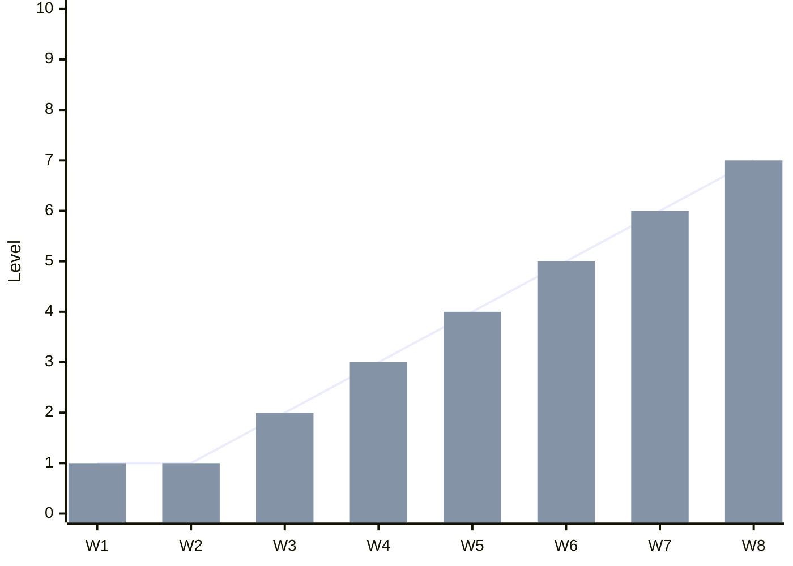
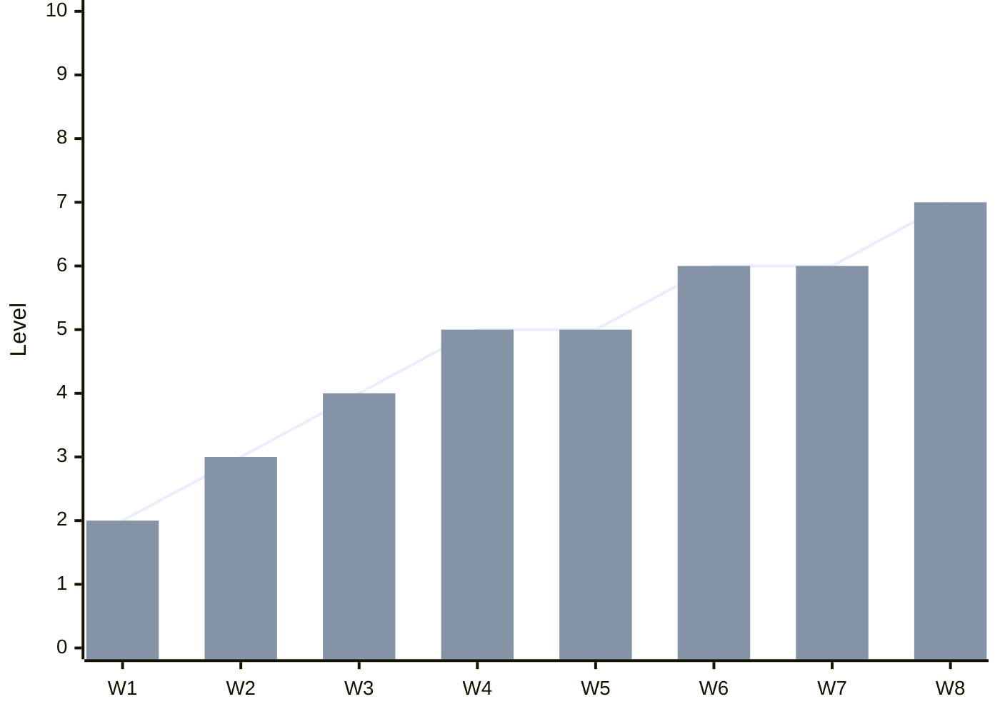
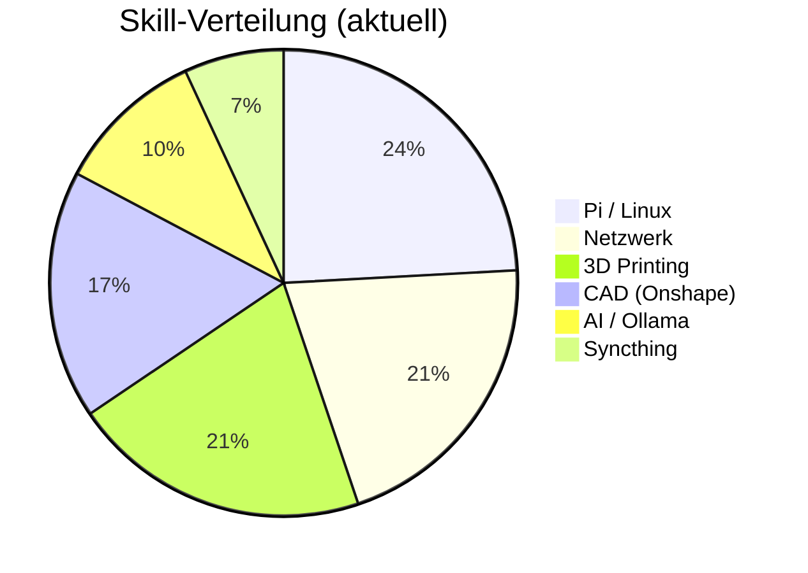

# 📈 Lernkurve – mTreeD Workshop Stack

> **Ziel:** Fortschritt sichtbar machen — nicht perfekt sein, sondern besser werden.

---

## Gesamtübersicht

---

## Skill-Bereiche

### 🐧 Raspberry Pi 5 / Linux (Headless)

| Meilenstein | Status |
|---|---|
| SSH-Verbindung aufgebaut | ✅ |
| mDNS (`raspberrypi.local`) konfiguriert | ✅ |
| Stromversorgung (5V/5A) optimiert | ✅ |
| Kühlungsreparatur (JST-SH Fan) | 🔧 offen |
| Ollama installiert & läuft | 📋 geplant |
| Syncthing aktiv | 📋 geplant |
| Claude Code deployment | 📋 geplant |

---

### 🌐 Netzwerk & Hotspot

| Meilenstein | Status |
|---|---|
| iPhone-Hotspot als Fallback | ✅ |
| Samsung Galaxy A52s Hotspot (mTreeD>IO) | ✅ |
| 5 GHz WPA2 konfiguriert | ✅ |
| Battery Protection aktiviert | ✅ |
| Statisches IP-Routing | 📋 geplant |

---

### 🖨️ 3D Printing / ProForge 5

| Meilenstein | Status |
|---|---|
| ProForge 5 Webserver erreichbar | ✅ |
| Erste Drucke erfolgreich | ✅ |
| Commissioning-Doku (mit Fotos) | 🔧 laufend |
| Onshape → STL → Druckpipeline | 🔧 laufend |

---

### 🧠 AI / Lokale LLMs (Ollama)

| Meilenstein | Status |
|---|---|
| Ollama auf Pi 5 installiert | 📋 geplant |
| Modell ausgewählt & geladen | 📋 geplant |
| Claude Code Integration | 📋 geplant |
| Lokale Inferenz stabil | 📋 geplant |

---

### 📐 CAD / Onshape

| Meilenstein | Status |
|---|---|
| Onshape Basics | ✅ |
| Erstes eigenes Modell | ✅ |
| Meshy AI Integration | 📋 geplant |
| Druckfertiger Export | 📋 geplant |

---

## Fortschritts-Snapshot

---

## Wochenrückblick

### Woche (KW __)

- **Was lief gut:**  
  - 

- **Blocker:**  
  - 

- **Nächste Schritte:**  
  - [ ] 
  - [ ] 
  - [ ] 

---

## Notizen

> Erkenntnisse, Aha-Momente, Ressourcen

- 

---

*Tags: #lernkurve #workshop #mtreeD #pi5 #progress*
